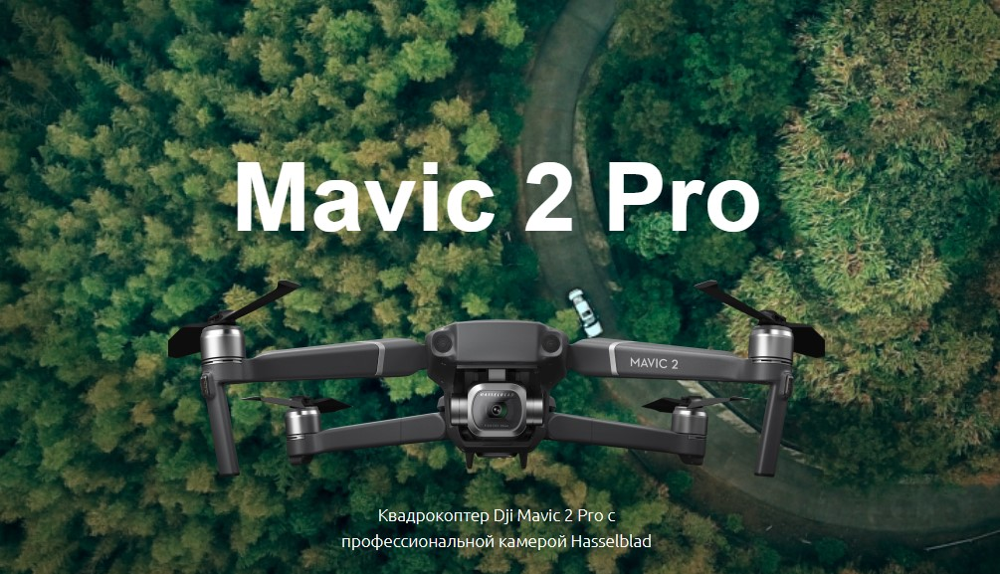

# Проект Mavic

<kbd>  </kbd>

### Описание:

Профессиональный квадрокоптер

[Макет проекта в Figma](https://www.figma.com/file/O7TM7GDZnO8XtlciMEiAtY/mavic?node-id=596%3A97 'ссылка на макет')

### Стек технологий:

| HTML <code></code> | CSS <code></code> | SCSS <code></code> | JavaScript <code></code> | Gulp <code></code> |
| ---------------------------------------------------------------------------------------------------------------------------------------------------------- | ------------------------------------------------------------------------------------------------------------------------------------------------------- | ---------------------------------------------------------------------------------------------------------------------------------------------------------- | ---------------------------------------------------------------------------------------------------------------------------------------------------------------------------- | ---------------------------------------------------------------------------------------------------------------------------------------------------------- |

### Инструкция по установке:

1. Установите [Node.js](https://nodejs.org/en/ 'ссылка на сайт Node.js')
2. Установите [Git](https://git-scm.com/ 'ссылка на сайт Git')
3. Скачайте архив данного репозитория или склонируйте себе при помощи команды:

```sh
git clone https://github.com/koshmar1319/mavic.git
```

4. Установите все зависимости:

```sh
npm install
```

5. Запустить проект:

```sh
gulp
```

### Демо:

> Github Pages <br/>[Ссылка на сайт :arrow_lower_right:](https://koshmar1319.github.io/mavic/index.html 'ссылка на сайт')
